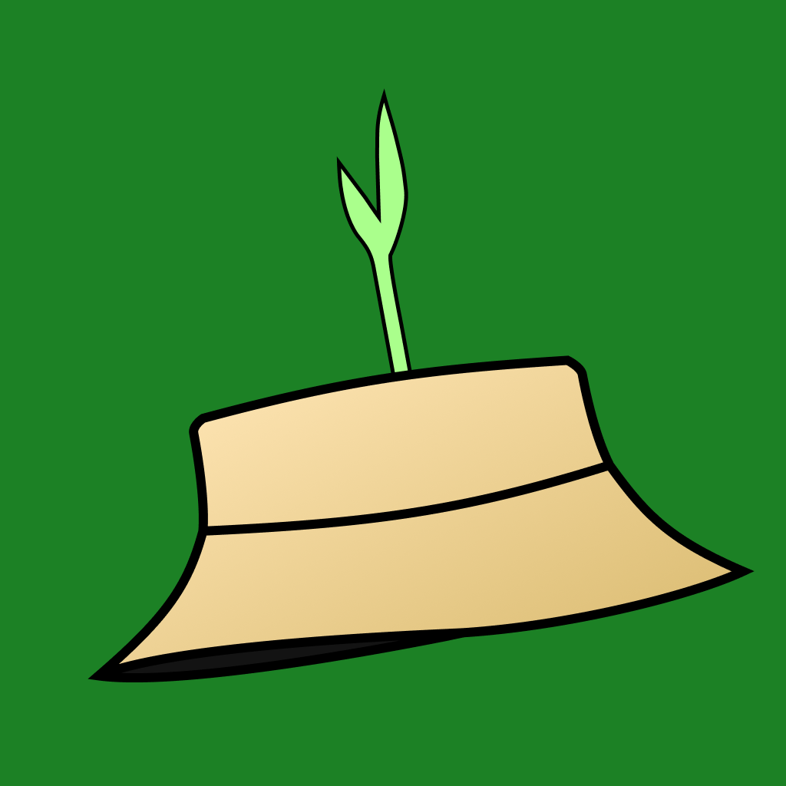

<h1 align="center"> Aplicativo IOS BioAgric </h1>

  <a href="#-tecnologias">Tecnologias</a>&nbsp;&nbsp;&nbsp;|&nbsp;&nbsp;&nbsp;
  <a href="#-projeto">Projeto</a>&nbsp;&nbsp;&nbsp;|&nbsp;&nbsp;&nbsp;
  <a href="#-layout">Layout</a>&nbsp;&nbsp;&nbsp;|&nbsp;&nbsp;&nbsp;

  

## 🚀 Tecnologias

Esse projeto foi desenvolvido com as seguintes tecnologias:

- UiKit e Storyboard
- API BioInsumos Embrapa: https://www.agroapi.cnptia.embrapa.br/store/apis/info?name=Bioinsumos&version=v1&provider=agroapi#/Inoculantes/getInoculantes
- Git e Github
- Pods: Alamofire

## 💻 Projeto

Aplicativo mobile na plataforma IOS que exibe informações de Inoculantes e Biopesticidas como fornecedorer, número de registro, se o produto é classificado como orgânica, etc, de forma simples e intuitiva.

## 🔖 Layout

O Aplicativo segue as Guidelines de design da Apple (HIG)
https://www.figma.com/file/a5tJMMxQ1N6ipKwieVvfqQ/UIGang?type=design&node-id=707%3A207&mode=design&t=LMHn0oFkHpZ13Koe-1
